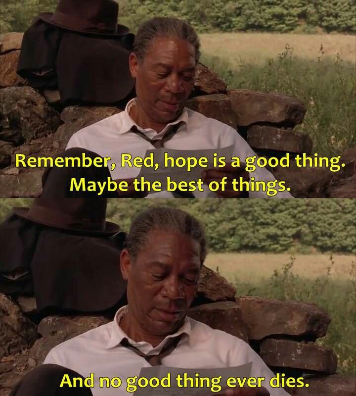
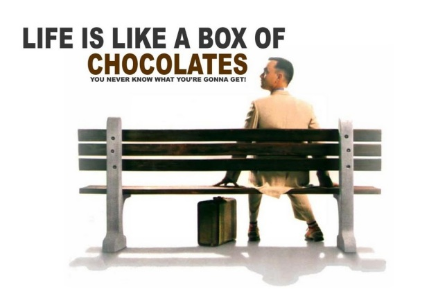
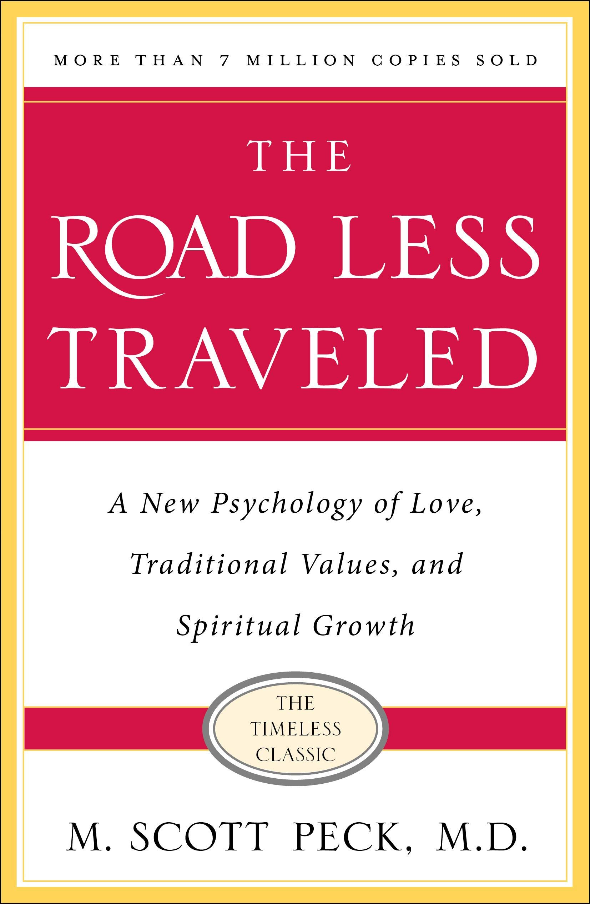

# Me 

"What contribution should I made to this society in my life ?". 

The movies that I like the most are The Shawshank Redemption and Forrest Gump.

The books that I found the most insightful is The Road Less Traveled by M. Scott Peck. 

