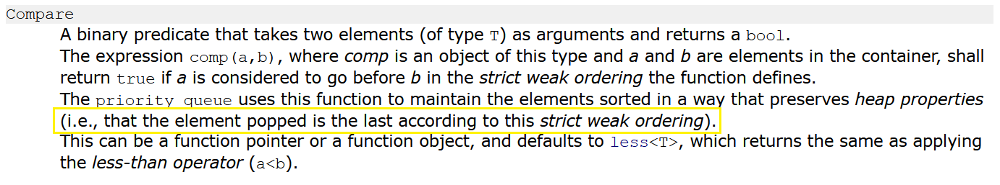

# Comparator

*(Source: https://stackoverflow.com/a/49546655)*

* The first parameter will go first if the return value of the comparator is true.
* So if return true when o1 < o2, we sort ascendingly, return true when o1 > o2, we sort descendingly. 

## Note About Priority Queue

*(Source: https://www.cplusplus.com/reference/queue/priority_queue/)*

* So the starting point is the leaf. 
* If we want a MIN-Heap, then `return true` when `o1 > o2`.
* If we want a MAX-Heap, then `return true` when `o1 < o2`. 
